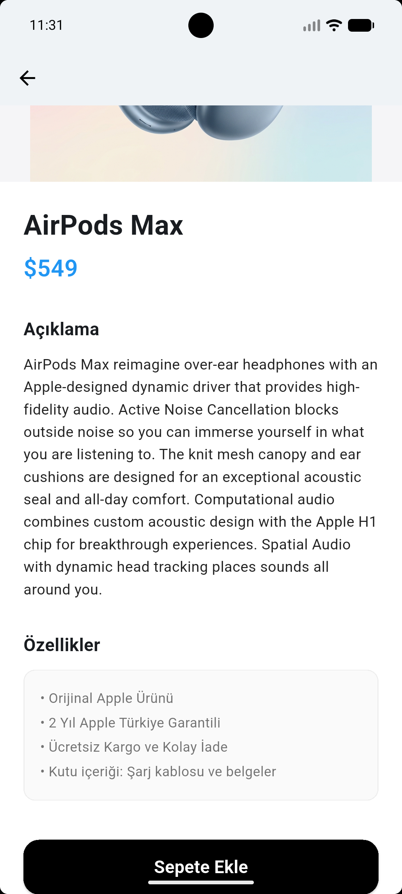
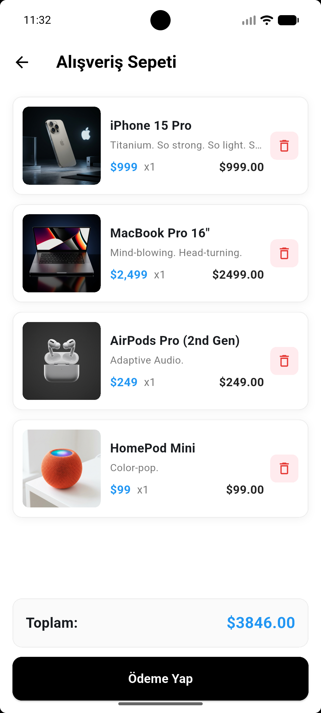
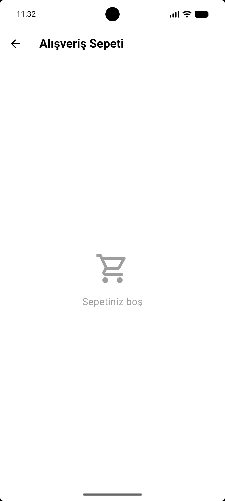

# 🛍️ Mini Katolog App

**Hızlı, Şık ve Kullanıcı Odaklı Dijital Vitrin**

Bu uygulama, mobil alışveriş deneyimini en sade ve estetik haliyle sunmak için geliştirilmiştir. Karmaşık yapılar yerine doğrudan ürüne ve görsel kaliteye odaklanan bir kullanıcı deneyimi sağlar.

---

## 🔥 Temel Özellikler

* **🎯 Kusursuz Görsel Deneyim:** Ana sayfadaki kampanya banner'ı, her ekran boyutuna tam uyum sağlar. Görseller asla kırpılmaz, esnemez ve orijinal oranlarını koruyarak (`BoxFit.fitWidth`) en yüksek kalitede görüntülenir.
* **🔍 Akıllı Arama Sistemi:** Kullanıcılar aradıkları ürünü yazmaya başladıkları anda sonuçlar gerçek zamanlı olarak filtrelenir. Hızlı ve akıcı bir arama motoru deneyimi sunar.
* **📐 Modern Tasarım Çizgileri:** Uygulamanın tüm görsel bileşenleri ve ürün kartları, modern tasarım standartlarına uygun şekilde yumuşatılmış köşelere (`BorderRadius`) sahiptir.
* **⚡ Dinamik Veri Akışı:** Uygulama, gücünü **WantAPI** altyapısından alır. Ürün bilgileri, fiyatlar ve stok durumları anlık olarak senkronize edilir.
* **🛡️ Robust Altyapı:** API'den gelen veriler titizlikle işlenir; bağlantı hataları veya beklenmedik veri yapılarında bile uygulama kararlılığını korur ve kullanıcıyı doğru şekilde yönlendirir.

---

## 🛠️ Teknoloji Yığını

* **Framework:** Google Flutter (Yüksek performanslı arayüz motoru)
* **Veri Kaynağı:** WantAPI (REST API servisleri)
* **Paketler:** `http` kütüphanesi üzerinden asenkron veri iletişimi.

---

## 📸 Uygulama Ekran Görüntüleri

   

> **Not:** Görseller cihaz genişliğine tam uyum sağlayacak şekilde optimize edilmiştir.

---

## 📋 Özet Yetenekler
* ✅ Orijinal oranları korunan, tam genişlikte akıllı banner.
* ✅ Anlık ürün filtreleme ve arama motoru.
* ✅ Göze hitap eden modern köşe yumuşatmaları.
* ✅ Hata toleranslı veri işleme mimarisi.

---

## 📄 Hakkında
Bu proje, dijital bir mağaza vitrininin en verimli ve estetik şekilde nasıl sunulabileceğini kanıtlamak amacıyla geliştirilmiştir. Tüm ürün verileri eğitim amaçlı olarak **WantAPI** üzerinden çekilmektedir.